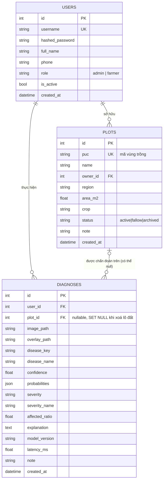
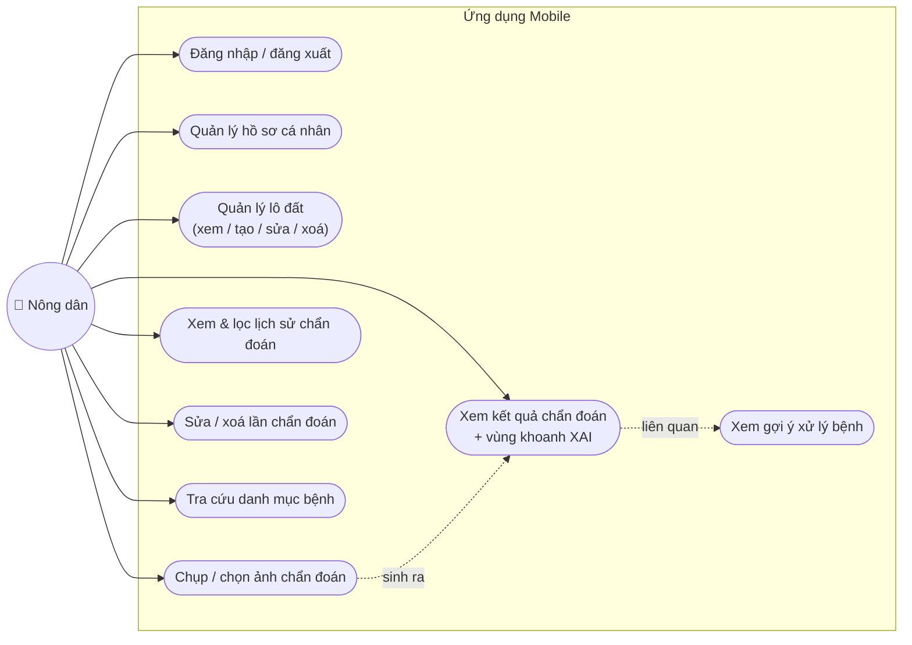
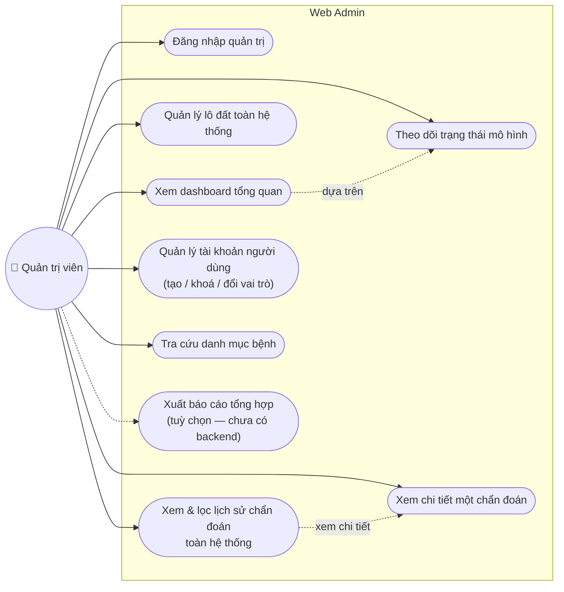

# Phân tích tình trạng hệ thống & hướng đi tiếp theo

> Ghi lại ngày 20/08/2026. Mục đích: chốt lại **thực tế** hệ thống đã làm được gì
> (đối chiếu code, không suy diễn), kiểm tra `CLAUDE.md` và quy ước Git có đang được
> tuân thủ không, và dựng sẵn danh sách use case cho hai giao diện chưa bắt đầu
> (`mobile/`, `web-admin/`) để khi bắt tay vào có khung sẵn, không phải nghĩ lại từ đầu.

---

## 1. Tóm tắt nhanh

| Phần | Trạng thái thực tế |
|---|---|
| `model/` | Code huấn luyện + Grad-CAM đã có. Dữ liệu PlantVillage đã tải (18.160 ảnh/10 lớp). Mới chạy thử 1 epoch, **chưa huấn luyện đầy đủ 25 epoch** — checkpoint thật chưa tồn tại |
| `backend/` | **Đã chạy được thật** — 3 bảng, 8 nhóm endpoint, JWT auth, 17/17 test pass. Đang chạy trên `DummyPredictor` vì chưa có checkpoint |
| `mobile/` | Chưa có code (kế hoạch từ 01/10/2026) |
| `web-admin/` | Vừa mới `npm create vite` — chỉ có scaffold rỗng (`package.json` tên `"temp"`), **chưa có màn hình nào** |
| Git hiện tại | Đang đứng trên `main`, có 5 file thay đổi/mới **chưa commit** (dockerize backend + khởi tạo web-admin) — xem mục 6.3 |

---

## 2. Backend đã có gì

### 2.1 Cơ chế chung
- FastAPI, SQLAlchemy 2.0 (kiểu `Mapped[...]`/`mapped_column`), JWT thuần (không session/cookie).
- Ranh giới `DiseasePredictor` (`model/src/predictor.py`) ↔ backend (`backend/app/services/inference/base.py`) đúng như `CLAUDE.md` mô tả: hai bên định nghĩa **cùng một dataclass `Prediction`** một cách độc lập (duck typing), backend không import PyTorch. Trường `organ` (leaf/fruit) **chưa được thêm** ở cả hai phía — khớp với việc phần quả chưa qua cổng go/no-go.
- `get_predictor()` (`backend/app/services/inference/loader.py`) chỉ dùng model thật khi `MODEL_CHECKPOINT` trỏ tới file tồn tại và import được; hiện `.env.example` để trống nên **toàn bộ hệ thống đang chạy trên `DummyPredictor`** (kết quả giả nhưng deterministic theo hash ảnh).

### 2.2 Endpoint hiện có (`/api/v1`)

| Nhóm | Endpoint | Ghi chú |
|---|---|---|
| Hệ thống | `GET /`, `GET /health` | `/health` báo luôn đang dùng model thật hay dummy |
| Auth | `POST /auth/login`, `POST /auth/token`, `GET /auth/me`, `PATCH /auth/me` | `/auth/token` chỉ để nút "Authorize" của Swagger hoạt động |
| Lô đất | `GET/POST /plots`, `GET/PATCH/DELETE /plots/{id}` | Tự sinh mã `PUC-YYMM-XXXX` nếu không truyền vào |
| Chẩn đoán | `POST/GET /diagnoses`, `GET/PATCH/DELETE /diagnoses/{id}` | `POST` chạy full pipeline: predictor → Grad-CAM → khoanh vùng → lưu ảnh → ghi bản ghi |
| Danh mục bệnh | `GET /diseases`, `GET /diseases/{key}` | Public, không cần đăng nhập |
| Thống kê (admin) | `GET /stats/dashboard` | Tổng hợp: tổng lô đất, tổng chẩn đoán, theo thời gian, theo bệnh/mức độ, model đang dùng |
| Tài khoản (admin) | `GET/POST /users`, `GET/PATCH /users/{id}` | Chặn admin tự khoá/tự hạ quyền chính mình |

Không có endpoint upload ảnh riêng — upload nằm trong `POST /diagnoses`.

### 2.3 Test
`backend/tests/test_api.py` — 17 test hàm, chạy trên SQLite tạm (không phải Postgres thật), che phủ: health/danh mục bệnh, auth, lô đất (kể cả phân quyền farmer không được gán lô đất cho người khác), luồng chẩn đoán đầy đủ (bao gồm tính deterministic của `DummyPredictor`, từ chối file không phải ảnh, phân trang lịch sử), và phân quyền admin/farmer.

**Điểm mù đã biết** (chính `CLAUDE.md` ghi lại): bộ test không có file `.env` thật nên không bắt được lỗi khởi động do `pydantic-settings` gọi `json.loads()` lên field `CORS_ORIGINS` trước khi validator tách dấu phẩy chạy — lỗi này đã xảy ra thật và đã sửa (`backend/app/core/config.py`), nhưng nếu ai đó vô tình revert phần sửa thì test hiện tại **sẽ không phát hiện ra**.

---

## 3. Cơ chế cơ sở dữ liệu

- **Đồng bộ (sync), không async**: `create_engine()` + `sessionmaker`, một `Session` mỗi request qua dependency `get_db()` (`backend/app/db/session.py`).
- **Khởi tạo bảng**: hiện dùng `Base.metadata.create_all()` (`backend/app/db/init_db.py`) — cách nhanh cho giai đoạn dev, docstring tự ghi rõ phải chuyển sang Alembic khi schema ổn định và cần giữ dữ liệu.
- **Alembic đã cấu hình nhưng chưa có migration nào** (`backend/migrations/versions/` chỉ có `.gitkeep`). Nghĩa là hiện tại đổi schema = xoá DB tạo lại, chưa migrate được dữ liệu thật. Cần bắt đầu viết migration đầu tiên trước khi có dữ liệu thật đáng giữ (trước demo, trước khi nông dân thật dùng thử).
- **PostgreSQL 16 (Docker) là môi trường chính**, `DATABASE_URL` mặc định trỏ vào đó. Test dùng SQLite tạm để chạy nhanh, không cần Docker.
- **Bài học dialect đã ghi nhận**: gom số chẩn đoán theo ngày trong `stats.py` được làm **bằng Python** (`Counter` trên danh sách `created_at` lấy về) thay vì `CAST(... AS DATE)` trong SQL, vì SQLite trả về số nguyên còn PostgreSQL trả về `date` cho cùng một câu SQL — đúng như lỗi thật đã note trong `CLAUDE.md`.

---

## 4. Danh sách bảng hiện tại

### `users`
| Cột | Kiểu | Ghi chú |
|---|---|---|
| id | int | PK |
| username | string(50) | unique, index |
| hashed_password | string(255) | bcrypt |
| full_name | string(120) | |
| phone | string(20) | nullable |
| role | string(20) | `"admin"` \| `"farmer"` — cố tình để string thường, không dùng DB enum, để tránh phiền khi migrate |
| is_active | bool | default true |
| created_at | datetime (tz) | server default now |

### `plots` (lô đất)
| Cột | Kiểu | Ghi chú |
|---|---|---|
| id | int | PK |
| puc | string(32) | unique, index — mã vùng trồng, giữ lại vì là thuộc tính vốn có của lô đất (xem `CLAUDE.md` mục phạm vi) |
| name | string(120) | |
| owner_id | int | FK → `users.id`, `ON DELETE CASCADE` |
| region | string(120) | nullable |
| area_m2 | float | nullable |
| crop | string(50) | default `"tomato"` |
| status | string(20) | `active` \| `fallow` \| `archived` |
| note | string(500) | nullable |
| created_at | datetime (tz) | |

### `diagnoses` (lần chẩn đoán)
| Cột | Kiểu | Ghi chú |
|---|---|---|
| id | int | PK |
| user_id | int | FK → `users.id` |
| plot_id | int | FK → `plots.id`, nullable, `ON DELETE SET NULL` — xoá lô đất **không** xoá lịch sử chẩn đoán |
| image_path | string(255) | ảnh gốc |
| overlay_path | string(255) | nullable — ảnh đã khoanh vùng XAI |
| disease_key | string(50) | index |
| disease_name | string(120) | |
| confidence | float | |
| probabilities | JSON | nullable — toàn bộ xác suất từng lớp, để phân tích sai số sau này |
| severity | string(20) | `none`/`mild`/`moderate`/`severe` |
| severity_name | string(50) | tên tiếng Việt |
| affected_ratio | float | default 0.0 |
| explanation | text | nullable — câu giải thích tiếng Việt |
| model_version | string(80) | default `"unknown"` |
| latency_ms | float | default 0.0 |
| note | string(500) | nullable |
| created_at | datetime (tz) | index |

Không có bảng `disease_catalog` trong DB — danh mục 10 bệnh nằm hẳn ngoài DB, đọc trực tiếp từ `shared/data/tomato_diseases.json` (đúng chủ đích: nguồn sự thật duy nhất, không nhân đôi dữ liệu).

### Sơ đồ ER



---

## 5. Đối chiếu `CLAUDE.md` với tài liệu phân tích đề tài gốc (`docx/Phân tích đề tài nhóm 3.docx`)

### 5.1 Nhất quán tốt
- **10 lớp bệnh**: danh sách trong PDF (mốc sương muộn, đốm vòng, mốc lá, đốm lá vi khuẩn, đốm lá Septoria, nhện đỏ hai chấm, đốm mắt cua, virus xoăn vàng lá, virus khảm, lá khoẻ) khớp **chính xác** với 10 khoá trong `shared/data/tomato_diseases.json`.
- **Vai trò XAI "cả hai làm"**: PDF ghi Bảo trích heatmap, Học đưa vào response — đúng với ranh giới thật trong code: `model/src/predictor.py` (Grad-CAM, phía Bảo) sinh `heatmap`, `backend/app/services/xai/{explain,overlay}.py` (phía Học) biến thành vùng khoanh + câu tiếng Việt.
- **Lưu trữ ảnh "file thường trong giai đoạn demo"**: đúng với `backend/app/services/storage/local.py` hiện tại (chưa dùng S3).
- **Transfer learning ResNet/EfficientNet**: định hướng kỹ thuật này không mâu thuẫn với những gì `CLAUDE.md` mô tả (không có gì trong `CLAUDE.md` đi ngược lại).

### 5.2 Lệch có chủ đích — đã ghi rõ lý do, không phải sai sót
- **API Gateway + `POST /api/disease-reports` + tích hợp PUC với nhóm 1/nhóm 2**: PDF (mục 1, 4.3, 4.4) coi đây là mục tiêu chính của API. `CLAUDE.md` **hoãn hẳn phần này** (quyết định 11/08/2026) và ghi rõ lý do (tránh phụ thuộc ngoài tầm kiểm soát tuần đầu). Backend hiện tại phản ánh đúng quyết định hoãn: không có endpoint `/api/disease-reports`, không có API Gateway, `shared/api-contract/` để trống. **Đây là lệch có chủ đích, đã tài liệu hoá — không phải lỗi.**
- **Bệnh trên thân**: PDF không nhắc gì tới bệnh thân (vốn PDF chỉ liệt kê bệnh lá). `CLAUDE.md` chủ động bỏ hẳn ý tưởng bệnh thân khi mở rộng phạm vi sang quả — không mâu thuẫn PDF, chỉ là quyết định mới hơn PDF không có.
- **Mở rộng 5 lớp bệnh quả + bộ định tuyến organ classifier**: hoàn toàn không có trong PDF gốc (PDF chỉ nói "mở rộng sang cây khác nếu còn thời gian", khác với "mở rộng bộ phận trên cùng một cây"). `CLAUDE.md` tự ghi chú lý do được miễn xin ý kiến GVHD ("đề cương không ghi chi tiết số lớp"). Hợp lý, nhưng **PDF phân tích chi tiết (tài liệu này) chưa được cập nhật lại theo hướng mới** — nên coi PDF là tài liệu lịch sử/tham khảo, không phải nguồn cập nhật, đúng như `CLAUDE.md` đã ngầm xác lập.

### 5.3 Điểm cần lưu ý
- PDF mục 4.4 gán trách nhiệm "kết nối với service của nhóm khác" cho Học — phần này đã hoãn nên **không nên đưa vào JD hiện tại của Học khi báo cáo tiến độ**, tránh gây hiểu nhầm cho GVHD rằng việc này đang bị trễ.
- PDF mục 5 (wireframe) đề cập "Xuất báo cáo tổng hợp theo tuần/tháng" ở web admin — **backend hiện chưa có endpoint export** nào (không có `GET /stats/export` hay tương tự). Nếu muốn giữ tính năng này trong demo thì cần thêm vào backlog; nếu không, nên bỏ khỏi use case web admin để không hứa quá tay (xem mục 7.2 — đã đánh dấu "tuỳ chọn, chưa triển khai").
- `CLAUDE.md` tự nhận `model/README.md` có con số "~16 phút/25 epoch" đo bằng tensor giả, lạc quan hơn thực tế đo được (~22–25 phút) — không phải vấn đề nghiêm trọng nhưng nếu đưa vào báo cáo/slide bảo vệ thì nên dùng con số đo thật (PR #78), không dùng con số trong README.

**Kết luận đối chiếu**: `CLAUDE.md` bám sát tinh thần đề tài gốc ở phần lõi (bệnh, kiến trúc XAI, công nghệ), và **mọi chỗ lệch với PDF đều được ghi lại có chủ đích kèm lý do** — không phát hiện lệch nào là do quên/sai sót. Rủi ro thực sự duy nhất là PDF cũ có thể gây hiểu nhầm nếu đưa thẳng cho GVHD xem mà không kèm theo các quyết định cập nhật trong `CLAUDE.md`.

---

## 6. Kiểm tra tuân thủ quy ước Git

### 6.1 Tên nhánh
Tất cả nhánh remote hiện có (`bao/task-01`…`bao/task-06`, `bao/task-76`, `bao/task-77`) đúng định dạng `<label>/task-<XX>-<mô-tả>`. Nhóm `task-01`…`task-06` đúng như `CLAUDE.md` ghi chú — có trước khi repo có issue nên số không khớp issue, đã merge xong và để nguyên. `task-76`, `task-77` khớp đúng số issue tương ứng (GitHub templates, đổi tên repo). **Không phát hiện vi phạm ở tên nhánh.**

### 6.2 Commit message
Toàn bộ commit gần đây tuân đúng định dạng `type(scope): mô tả ngắn tiếng Anh, chữ thường, thể mệnh lệnh`. **Không phát hiện vi phạm.**

### 6.3 ⚠️ Vi phạm phát hiện được: commit trực tiếp lên `main`

`CLAUDE.md` ghi rõ: *"Không commit thẳng lên `main`."* Nhưng lịch sử commit hiện tại cho thấy:

```
3715a19 (parent: 940c3fc, KHÔNG phải merge) docs: add first progress report for advisor meeting
940c3fc (parent: 2dfd051, KHÔNG phải merge) docs(claude): update status after dataset download and smoke test
```

Hai commit này có **đúng một cha** (không phải merge commit từ PR) — tức là được commit thẳng lên `main`, không qua nhánh `task-XX` + PR như quy trình đã định. Cả hai đều chỉ sửa tài liệu (`.md`) nên rủi ro thấp, nhưng đây vẫn là vi phạm quy ước bằng văn bản.

**Đang có nguy cơ lặp lại ngay lúc này**: nhánh hiện tại của working directory là `main`, và đang có **thay đổi chưa commit**:
- `docker-compose.yml` (sửa) — thêm service `backend` (Dockerfile.dev) và `web-admin` (Vite dev server)
- `backend/Dockerfile.dev` (mới)
- `web-admin/.gitignore`, `web-admin/index.html`, `web-admin/package.json`, `web-admin/vite.config.js` (mới — khung Vite/React vừa tạo, tên project còn để mặc định `"temp"`)

Đây là các thay đổi mã nguồn/hạ tầng thật (không chỉ tài liệu), nên nếu commit thẳng từ đây sẽ là vi phạm nghiêm trọng hơn hai commit docs ở trên. **Khuyến nghị**: tạo nhánh `hoc/task-XX-...` (khớp issue tương ứng, ví dụ issue dựng khung web-admin ở Mốc 1) rồi mới commit các thay đổi này, thay vì commit tiếp lên `main`.

---

## 7. Danh sách use case dự kiến

### 7.1 Mobile — Nông dân (Farmer)

| Mã | Use case | Cơ sở |
|---|---|---|
| UC-M1 | Đăng nhập / đăng xuất | `POST /auth/login` |
| UC-M2 | Xem hồ sơ cá nhân, đổi mật khẩu/SĐT | `GET/PATCH /auth/me` |
| UC-M3 | Xem danh sách lô đất của mình (kèm lần chẩn đoán gần nhất mỗi lô) | `GET /plots` |
| UC-M4 | Tạo lô đất mới (mã PUC tự sinh nếu không nhập) | `POST /plots` |
| UC-M5 | Sửa thông tin lô đất (khu vực, diện tích, trạng thái, ghi chú) | `PATCH /plots/{id}` |
| UC-M6 | Xoá lô đất | `DELETE /plots/{id}` |
| UC-M7 | Chụp ảnh hoặc chọn ảnh có sẵn để chẩn đoán, gán vào một lô đất | `POST /diagnoses` |
| UC-M8 | Xem kết quả chẩn đoán: tên bệnh, độ tin cậy, mức độ nghiêm trọng, ảnh khoanh vùng XAI, câu giải thích tiếng Việt, top-3 dự đoán, khuyến cáo miễn trừ trách nhiệm | `GET /diagnoses/{id}` |
| UC-M9 | Xem gợi ý xử lý bệnh (thuốc/biện pháp theo từng loại tác nhân — kể cả trường hợp không phải nấm/vi khuẩn như nhện đỏ) | `GET /diseases/{key}` (trường `treatments`) |
| UC-M10 | Xem lịch sử chẩn đoán của bản thân, lọc theo lô đất/bệnh/mức độ/thời gian | `GET /diagnoses` |
| UC-M11 | Sửa ghi chú hoặc gán lại lô đất cho một lần chẩn đoán cũ | `PATCH /diagnoses/{id}` |
| UC-M12 | Xoá một lần chẩn đoán | `DELETE /diagnoses/{id}` |
| UC-M13 | Tra cứu danh mục bệnh cà chua (không cần đăng nhập) | `GET /diseases` |

> Ghi chú: nhánh "ảnh không rõ lá/quả cà chua → yêu cầu chụp lại" (phần mở rộng bệnh quả, `CLAUDE.md` mục kiến trúc) **chưa đưa vào danh sách trên** vì còn phụ thuộc cổng go/no-go 15/09/2026. Nếu qua cổng, thêm UC-M14 "Nhận thông báo ảnh không hợp lệ khi không phải lá/quả cà chua".

### 7.2 Web Admin — Quản trị viên

| Mã | Use case | Cơ sở |
|---|---|---|
| UC-A1 | Đăng nhập quản trị | `POST /auth/login` (role=admin) |
| UC-A2 | Xem dashboard tổng quan: tổng lô đất, tổng nông dân, tổng lượt chẩn đoán, số liệu theo thời gian, theo loại bệnh, theo mức độ | `GET /stats/dashboard` |
| UC-A3 | Xem trạng thái mô hình đang chạy (model thật hay `DummyPredictor`, phiên bản model) | `GET /health`, `GET /stats/dashboard` |
| UC-A4 | Xem/tìm/lọc toàn bộ lô đất trong hệ thống (không giới hạn theo một nông dân) | `GET /plots` (admin có thể lọc theo `owner_id`) |
| UC-A5 | Xem/lọc lịch sử chẩn đoán toàn hệ thống theo lô đất, người dùng, bệnh, mức độ, thời gian | `GET /diagnoses` (admin thấy toàn bộ) |
| UC-A6 | Xem chi tiết một lần chẩn đoán bất kỳ (ảnh gốc, ảnh khoanh vùng, giải thích) | `GET /diagnoses/{id}` |
| UC-A7 | Xem danh sách tài khoản người dùng, tìm/lọc theo vai trò, trạng thái | `GET /users` |
| UC-A8 | Tạo tài khoản người dùng mới (farmer hoặc admin) | `POST /users` |
| UC-A9 | Khoá/mở khoá tài khoản, đổi vai trò người dùng (không tự khoá/tự hạ quyền chính mình) | `PATCH /users/{id}` |
| UC-A10 | Tra cứu danh mục bệnh dùng chung (chỉ xem — nguồn sự thật là file JSON, không sửa qua web admin) | `GET /diseases` |
| UC-A11 *(tuỳ chọn, chưa triển khai)* | Xuất báo cáo tổng hợp theo tuần/tháng/khu vực | Có trong đề xuất PDF gốc, **backend hiện chưa có endpoint export** — cần bổ sung nếu giữ tính năng này |

---

## 8. Sơ đồ use case

### 8.1 Mobile — Nông dân



### 8.2 Web Admin — Quản trị viên



---

## 9. Khuyến nghị hướng đi tiếp theo

1. **Xử lý ngay việc đang đứng trên `main` với thay đổi chưa commit** (mục 6.3) — tách ra nhánh `hoc/task-XX` đúng issue trước khi commit, để không lặp lại vi phạm quy ước Git lần thứ ba.
2. **Bắt đầu viết migration Alembic đầu tiên** trước khi có dữ liệu thật trong Postgres — hiện `create_all()` là chấp nhận được cho dev nhưng sẽ gây mất dữ liệu ngay lần đổi schema đầu tiên sau khi có dữ liệu thật.
3. **Mốc 3 (giao diện trên `DummyPredictor`)** đã có đủ cơ sở để bắt đầu: 8 nhóm endpoint ở mục 2.2 và danh sách use case ở mục 7 là đủ để dựng cả `mobile/` và `web-admin/` song song mà không cần chờ mô hình thật — đúng tinh thần `CLAUDE.md`.
4. **UC-A11 (xuất báo cáo)** cần quyết định giữ hay bỏ sớm — nếu giữ, thêm vào issue backlog Mốc 4; nếu bỏ, nên nói rõ trong lần cập nhật `CLAUDE.md` tiếp theo để không ai ngỡ tính năng này "quên làm".
5. Việc huấn luyện đầy đủ 25 epoch (#14) vẫn là việc chặn tiến độ quan trọng nhất hiện tại — mọi thứ ở backend đã sẵn sàng nhận checkpoint thật ngay khi có (chỉ cần set `MODEL_CHECKPOINT` trong `.env`), không cần sửa code.
